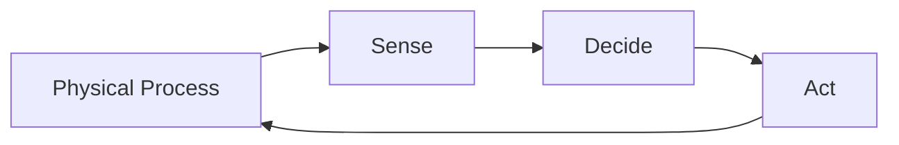
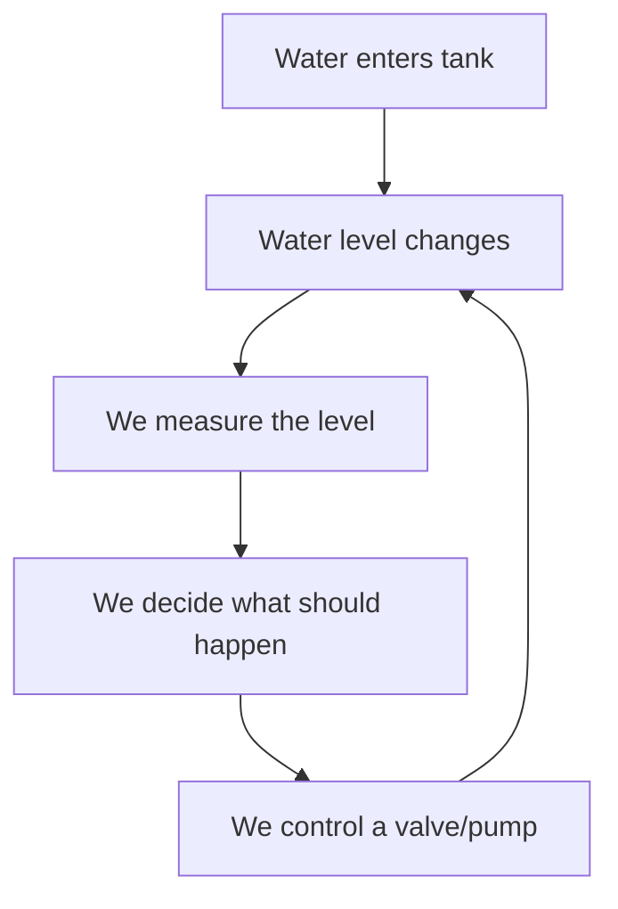
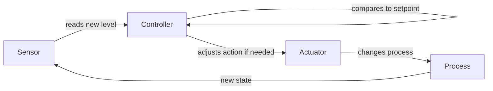
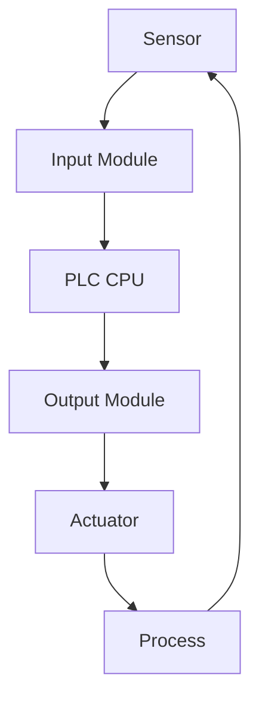
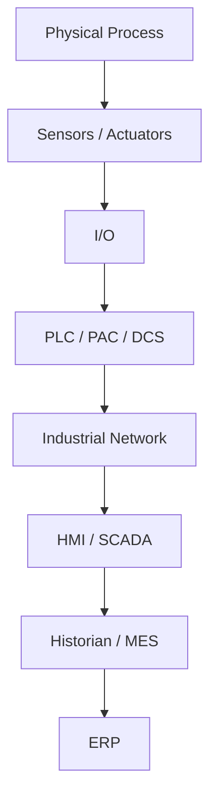
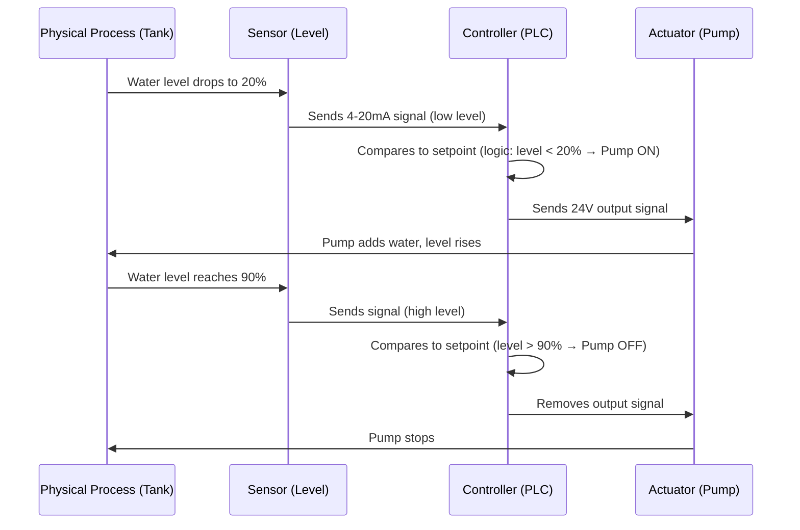

# What Is Industrial Automation?

> **DeepURForge Research Series — Article 01**
> Foundations of Industrial Automation, built from first principles.

---

## 1. The Problem Automation Solves

Before any technology existed, every industrial process was run by a human being who watched a physical quantity and reacted to it by hand.

A worker watching a boiler had to:
- **Observe** — look at a pressure gauge
- **Judge** — decide if the pressure was too high or too low
- **Act** — open or close a valve
- **Repeat** — do this continuously, without a break, without a mistake

This works, but it has hard limits:
- Humans get tired, distracted, and slow
- Humans can't watch 500 variables at once
- Humans can't react in milliseconds
- Humans can't work in toxic, extreme-heat, or high-radiation environments
- Human judgment is inconsistent between one person and another

Industrial automation exists to remove these limits — not by eliminating the *logic* of observing and reacting, but by moving that logic into a machine that can do it faster, longer, and more consistently than a person can.

---

## 2. What Is Automation?

**ISA (International Society of Automation)** defines automation as *the creation and application of technology to monitor and control the production and delivery of products and services.*

Two words carry all the weight in that sentence: **monitor** and **control**.

- **Monitor** = continuously acquire information about the real, physical state of something (a temperature, a level, a speed, a position).
- **Control** = use that information to decide on and execute an action that changes or maintains that physical state.

**NIST** describes an Industrial Control System (ICS) as a combination of electrical, mechanical, hydraulic, and pneumatic components that work together to achieve an industrial objective (e.g., manufacturing, transportation of matter or energy).

So automation is not "a computer running a factory." It is the *general principle* of replacing a human observing-and-reacting loop with a technological one — the computer, PLC, or controller is just one possible implementation of that principle.

**Key distinction:**
| Term | What it means | What it does NOT mean |
|---|---|---|
| Monitor | Continuously sense real-world state | Just "having a sensor installed" |
| Control | Decide + execute a corrective/maintaining action | Just "having an output wire" |

---

## 3. Automation vs Mechanization

These two are commonly confused, but they are fundamentally different concepts.

**Mechanization** = replacing human *muscle* with a machine.
> Example: A conveyor belt moves boxes instead of a person carrying them. A motor turns a shaft instead of a person cranking it.

Mechanization removes physical effort. It does **not** remove decision-making. A human still watches and decides when to start, stop, or adjust the machine.

**Automation** = replacing human *judgment and reaction* with a system that senses, decides, and acts on its own.
> Example: A level sensor detects the tank is full and the system decides — without a person — to close the inlet valve.

**The test:**
> If a motor replaces human muscle, that is mechanization.
> If a sensor detects a condition **and** a controller automatically decides what to do about it, that is automation.

Mechanization answers "how do we do the work?"
Automation answers "how do we decide what work to do, and when?"

In real industrial systems, mechanization and automation are layered together: automation supplies the decisions, mechanization supplies the physical muscle that carries them out.

---

## 4. The Fundamental Automation Loop

Every automated system — no matter how simple or complex — reduces to the same closed loop:



This is the single idea that everything else in industrial automation is built on top of. A single-tank level controller and an entire oil refinery both run on this same loop — the refinery just has thousands of these loops running simultaneously and talking to each other.

---

## 5. The Physical Process

The **process** is the real, physical thing you are trying to control. It is not the technology — it is the world the technology is acting on.

Common physical quantities that get automated:

| Process Variable | Real-world example |
|---|---|
| Temperature | Furnace, oven, chiller |
| Pressure | Boiler, pipeline, gas tank |
| Level | Water tank, silo, reservoir |
| Flow | Pipe carrying liquid or gas |
| Speed | Motor, conveyor, pump |
| Position | Robotic arm, valve actuator |

**Worked example — the water tank:**



Everything from here forward in this article uses the water tank as the running example, because it is simple enough to reason about completely, yet contains every element a factory-scale system has.

---

## 6. Sensors — How the System Knows

A **sensor** is the component that converts a physical quantity into a signal the rest of the system can use.

For the water tank, this could be a **level sensor** — for example, an ultrasonic sensor that measures the distance from itself down to the water surface, or a float switch that physically rises and falls with the water.

The critical thing a sensor does is **translate**:

```
Physical quantity (water level in cm)
        ↓
Physical effect (e.g., time for ultrasonic echo to return)
        ↓
Electrical signal (e.g., 4–20 mA or 0–10V)
        ↓
Value the controller can read
```

Without a sensor, "monitoring" is impossible — the controller has no way to know the current state of the physical world. This is why sensor accuracy, range, and response time are treated as critical specifications in real industrial design: a controller can never be more accurate than the information it's given.

---

## 7. Decision and Control

The **controller** is the component that takes the sensor's information and decides what action, if any, to take.

For the water tank, the decision logic might be as simple as:

```
IF level < 20%  → turn pump ON  (fill the tank)
IF level > 90%  → turn pump OFF (stop filling)
ELSE            → do nothing
```

This simple ON/OFF logic is called **bang-bang control**. Real industrial controllers often use more refined logic (like PID control, which adjusts output proportionally rather than snapping fully on/off), but the *role* of the controller is identical in both cases: **take input, apply a decision rule, produce an output.**

This is the step where "automation" truly separates itself from "mechanization" — a motor spinning a conveyor makes a decision *for* nothing; a controller comparing a sensor value to a setpoint makes an actual judgment call, autonomously, every scan cycle.

---

## 8. Actuation — How the System Acts

An **actuator** is the component that physically changes the process in response to the controller's decision. It's the controller's "hands."

For the water tank: a **pump** (to add water) or a **valve** (to release water) are the actuators.

```
Controller decision: "turn pump ON"
        ↓
Output signal sent (e.g., 24V DC to a relay/contactor)
        ↓
Relay energizes
        ↓
Pump motor receives power
        ↓
Pump physically moves water
        ↓
Water level in tank rises
```

**Animation concept (for your GitHub visual):**
> Water level falls → sensor detects the drop → PLC decides to start the pump → pump activates → water level rises → sensor detects the tank is full → PLC decides to stop the pump.

This is the moment where an *electrical decision* becomes a *physical event* — the whole reason the automation system exists is to produce this final physical action correctly and on time.

---

## 9. Feedback

**Feedback** is what closes the loop. It's how the system verifies whether its own action actually produced the intended result.



Without feedback, a system is "open-loop" — it acts blindly and has no way to know if the action worked, over-worked, or failed entirely (e.g., a stuck valve, a burnt-out pump). Feedback is what allows a system to *correct itself* instead of just *executing a command once and hoping*.

This is the property that makes closed-loop automated systems fundamentally more reliable than simple mechanized ones.

---

## 10. Where the PLC Fits

A **PLC (Programmable Logic Controller)** is the industrial-hardened computer that most commonly plays the role of "Controller" in the loop above.



Tracing what physically happens at each arrow:

1. **Sensor → Input Module**: The sensor outputs a real electrical signal — often 4–20 mA (analog) or a 24V DC ON/OFF signal (digital).
2. **Input Module**: This signal is *conditioned* — filtered, isolated, and converted (analog signals go through an A/D converter) so the PLC's CPU can safely and accurately read it as a number.
3. **Input Module → CPU**: The conditioned value is written into the PLC's internal memory as a data value (a register or bit).
4. **CPU (scan cycle)**: The PLC continuously runs a repeating cycle — read all inputs → execute the user's logic program (e.g., ladder logic) → write all outputs — typically many times per second.
5. **CPU → Output Module**: Based on the logic, the CPU sets an output bit/value in memory.
6. **Output Module → Actuator**: This value is converted back into a real electrical signal (e.g., 24V DC to energize a relay or drive an analog output to a valve positioner).
7. **Actuator → Process**: The physical actuator moves, and the real-world process changes as a result.

The PLC, in other words, is not magic — it is simply a purpose-built device that sits in the "Decide" position of the fundamental loop, reading signals in, running logic, and writing signals out, on a fast, reliable, repeating cycle.

---

## 11. From One Control Loop to an Industrial System

A real factory is not one loop — it's thousands of these loops, layered into a hierarchy:



NIST describes **Operational Technology (OT)** broadly as the systems and devices that interact with the physical environment through monitoring and control — which spans everything from a single sensor up through the SCADA layer. ISA's definition of automation covers this entire scope too — from the lowest-level loop to the top of the hierarchy.

Each layer up this stack does the same fundamental thing (sense → decide → act) but at a different scope and time scale:
- **PLC** — controls a single machine or process, in milliseconds
- **SCADA/HMI** — supervises many PLCs across a site, in seconds
- **Historian/MES** — tracks production and quality trends, over hours/shifts
- **ERP** — manages business-level planning, over days/weeks

This article will only introduce this relationship — each layer deserves its own deep-dive article later in this series.

---

## 12. Real-World Example — The Water Tank, Fully Automated

Bringing every concept together in one system:



Nothing here is guesswork or assumption — every step is a real, physical or electrical event, and the whole system is just the fundamental loop (Section 4) run continuously.

---

## 13. First-Principles Mental Model

Strip away every brand name, product, and acronym, and industrial automation is just this:

> **A system that continuously knows the true state of a physical thing, compares that state to what it should be, and takes action to close the gap — without needing a human to do it manually, every time.**

- The **sensor** answers: *"What is actually happening right now?"*
- The **controller** answers: *"What should happen, and how do we get there?"*
- The **actuator** answers: *"How do we physically make that happen?"*
- **Feedback** answers: *"Did it actually work?"*

Every PLC, SCADA system, robot, and industrial network that will appear later in this series is just a more elaborate way of answering these same four questions, faster, at larger scale, and with more variables.

---

## 14. Key Takeaways

- Automation = **monitor** + **control**, applied by technology instead of a human.
- Mechanization replaces **muscle**; automation replaces **judgment and reaction**.
- Every automated system is built from the same loop: **Process → Sensor → Controller → Actuator → back to Process.**
- A **PLC** is one specific, industrial-hardened implementation of the "Controller" role.
- **Feedback** is what makes a system self-correcting instead of blind.
- Real factories stack many of these loops into a hierarchy: **Process → I/O → PLC → Network → SCADA → Historian/MES → ERP.**

---

## 15. Questions for Further Investigation

These will seed the next articles in this series:

1. What exactly is a "process" — how do we classify continuous vs. batch vs. discrete processes?
2. How does an analog sensor signal (4–20 mA) actually get converted into a digital number inside a PLC?
3. What is the difference between a PLC, a PAC, and a DCS — and when is each one used?
4. What does a PLC's "scan cycle" actually look like internally (input scan, logic solve, output scan)?
5. How does PID control differ from simple ON/OFF (bang-bang) control?
6. What industrial network protocols (Modbus, Profibus, EtherNet/IP) carry these signals between devices?
7. What is the actual difference between SCADA and an HMI?

---

## References

- ISA (International Society of Automation) — definition of automation as the creation and application of technology to monitor and control production and delivery of products and services.
- NIST Special Publication 800-82 — *Guide to Industrial Control Systems (ICS) Security* — description of ICS components (electrical, mechanical, hydraulic, pneumatic) and control loop elements (sensors, controllers, actuators).
- NIST — description of Operational Technology (OT) as systems/devices interacting with the physical environment through monitoring and control.
- GitHub Docs — Mermaid diagram rendering support in Markdown; automatic outline generation from Markdown headings.

---

*DeepURForge Research Notebook — Article 01 of the Industrial Automation series. Next: "What Exactly Is a Process?"*
