# Where Did Industrial Automation Begin? — A History

> Industrial automation did not begin with PLCs, robots, or computers.
> It evolved step by step — from mechanical machines, to feedback mechanisms, to electrical control, to electronics, and finally to computing and networked intelligence.

This chapter traces that evolution as a *chain of problems and solutions*, not a list of dates. Every technology on this timeline exists because the technology before it hit a limit.

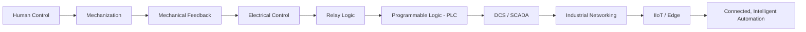

---

## Table of Contents

1. [Before Industrial Automation — Humans Controlled Everything](#1-before-industrial-automation--humans-controlled-everything)
2. [Mechanization ≠ Automation](#2-mechanization--automation)
3. [The First Industrial Revolution — Mechanical Roots](#3-the-first-industrial-revolution--mechanical-roots)
4. [James Watt's Governor — The Birth of Feedback](#4-james-watts-governor--the-birth-of-feedback)
5. [The Jacquard Loom — Machines Begin Following Instructions](#5-the-jacquard-loom--machines-begin-following-instructions)
6. [19th Century — From Mechanical Control to Automatic Regulation](#6-19th-century--from-mechanical-control-to-automatic-regulation)
7. [The Second Industrial Revolution — Electrification](#7-the-second-industrial-revolution--electrification)
8. [Relay Logic — The Predecessor of the PLC](#8-relay-logic--the-predecessor-of-the-plc)
9. [Ford and Mass Production](#9-ford-and-mass-production)
10. [Feedback Control Becomes a Science](#10-feedback-control-becomes-a-science)
11. [Electronics and Computing Enter Automation](#11-electronics-and-computing-enter-automation)
12. [1968–1970 — The Birth of the PLC](#12-19681970--the-birth-of-the-plc)
13. [The Third Industrial Revolution — Computerized Automation](#13-the-third-industrial-revolution--computerized-automation)
14. [1975 — The Birth of the DCS](#14-1975--the-birth-of-the-dcs)
15. [1980s–1990s — Industrial Networking](#15-1980s1990s--industrial-networking)
16. [2000s — Ethernet and Connected Automation](#16-2000s--ethernet-and-connected-automation)
17. [Industry 4.0](#17-industry-40)
18. [Today — Connected, Intelligent Automation](#18-today--connected-intelligent-automation)
19. [The Master Evolution Diagram](#19-the-master-evolution-diagram)
20. [What Actually Changed at Every Stage?](#20-what-actually-changed-at-every-stage)
21. [The First-Principles Mental Model](#21-the-first-principles-mental-model)
22. [References](#22-references)

---

## 1. Before Industrial Automation — Humans Controlled Everything

Before any machine could regulate itself, a **human being was the controller**. A worker watched a process, judged its state, and physically intervened to correct it.


*Workers at the Ford Highland Park plant, 1913 — humans performing the sensing, deciding, and acting that automation would later take over. (Source: [Wikimedia Commons](https://commons.wikimedia.org/wiki/File:Ford_assembly_line_-_1913.jpg), public domain)*

This manual control loop had four parts, all performed by a person:

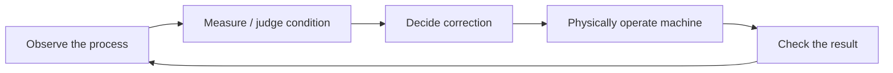

Characteristics of this era:

- **Human-operated machines** — power (water wheels, animals, hand tools) existed, but *control* was entirely manual.
- **Manual measurement** — a worker judged speed, temperature, or tension by eye, sound, or touch.
- **Manual adjustment** — every correction required a human hand on a valve, lever, or wheel.
- **Manual material handling** — parts moved from station to station because someone carried them.

Industries wanted machines that could **repeat work identically**, faster, and without fatigue — this desire is the root motivation for everything that follows in this document.

---

## 2. Mechanization ≠ Automation

This distinction is the single most important idea in this chapter, and it is often confused.

**Mechanization** replaces human *muscle*. A human is still the controller.

```
Human → Machine → Work
```

**Automation** replaces human *judgment and correction* — a sensor and controller close the loop instead of a person.

```
Sensor / Measurement → Controller → Actuator → Machine → Feedback (back to Controller)
```

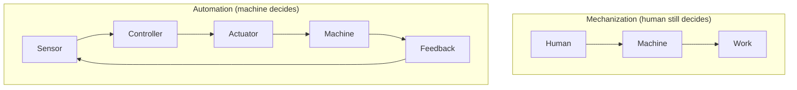

A steam-powered loom operated by a person is mechanization. The same loom regulated by a governor that automatically adjusts steam flow — with no person in the correction loop — is automation. Almost every "history of automation" article blurs this line; this repository deliberately does not.

---

## 3. The First Industrial Revolution — Mechanical Roots

The roots of industrial automation lie in the **First Industrial Revolution** (commonly dated from the 1760s), where water and steam power began replacing human and animal muscle in production.

Key developments:

- **Steam power** — engines that converted heat into continuous mechanical motion.
- **Textile machinery** — spinning and weaving mechanized for the first time.
- **Factories** — production concentrated in one location around a shared power source.
- **Machines replacing physical human effort** — the first large-scale substitution of muscle by machine.
- A growing industrial need for **speed, repeatability, and control**.

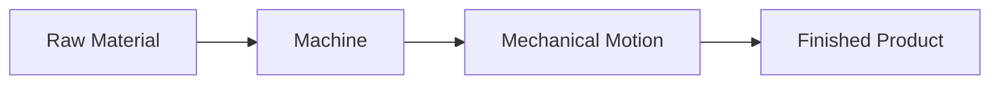

This era produced *power* and *mechanization* — but not yet *automation*. That leap required something else: a machine that could correct itself.

---

## 4. James Watt's Governor — The Birth of Feedback

This is, arguably, the single most important concept in the entire history of automation: **feedback**.


*A centrifugal (flyball) governor, Science Museum, London. (Source: [Wikimedia Commons](https://commons.wikimedia.org/wiki/File:Centrifugal_flyball_governor.jpg), CC BY 3.0)*

In 1788, James Watt adapted the centrifugal governor to regulate his steam engine. As the engine sped up, spinning weights flew outward under centrifugal force; that mechanical motion throttled the steam valve, slowing the engine back down — with no human involved in the correction.

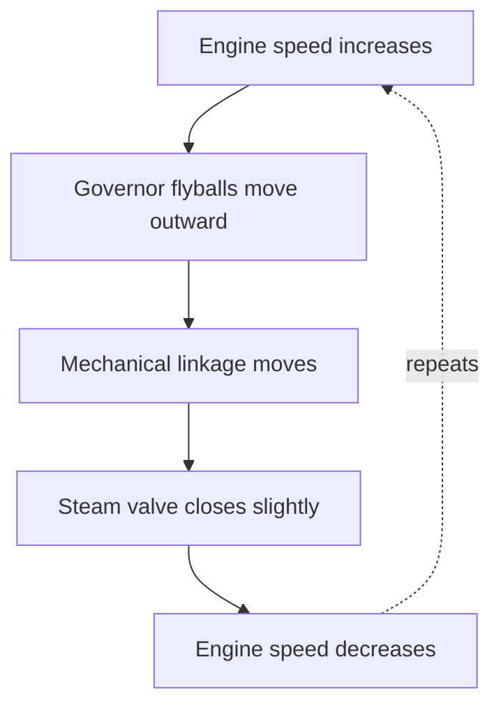

This is a **closed loop**: measure → compare → correct → measure again. It is the exact same principle that lives inside every modern PID controller, every PLC control loop, and every process controller in a chemical plant today. The technology has changed radically since 1788; the *loop* has not.

> Every feedback system you will study later in this repository — PID control, cascade control, SCADA alarm logic — is a descendant of this single mechanical idea.

---

## 5. The Jacquard Loom — Machines Begin Following Instructions


*A Jacquard loom showing its punched-card control mechanism, National Museum of Scotland. (Source: [Wikimedia Commons](https://commons.wikimedia.org/wiki/File:A_Jacquard_loom_showing_information_punchcards,_National_Museum_of_Scotland.jpg))*

Joseph Marie Jacquard demonstrated his loom in 1801. Chained punched cards told the loom which threads to raise for each pass of the shuttle — the loom followed a **stored, repeatable sequence of instructions** instead of a weaver's constant manual judgment.

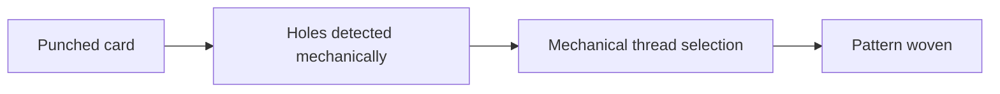

This is the conceptual bridge to programmability:

```
Program → Controller → Output
```

The Jacquard loom's punched cards later inspired Charles Babbage's Analytical Engine and Herman Hollerith's tabulating machines — a direct conceptual line runs from this 1801 loom to the punched paper tape used to program early PLCs 170 years later.

---

## 6. 19th Century — From Mechanical Control to Automatic Regulation

Through the 19th century, the *concept* of self-regulation spread far beyond steam engines: pressure regulators, float valves, and automatic looms all applied the same feedback principle to new machines.

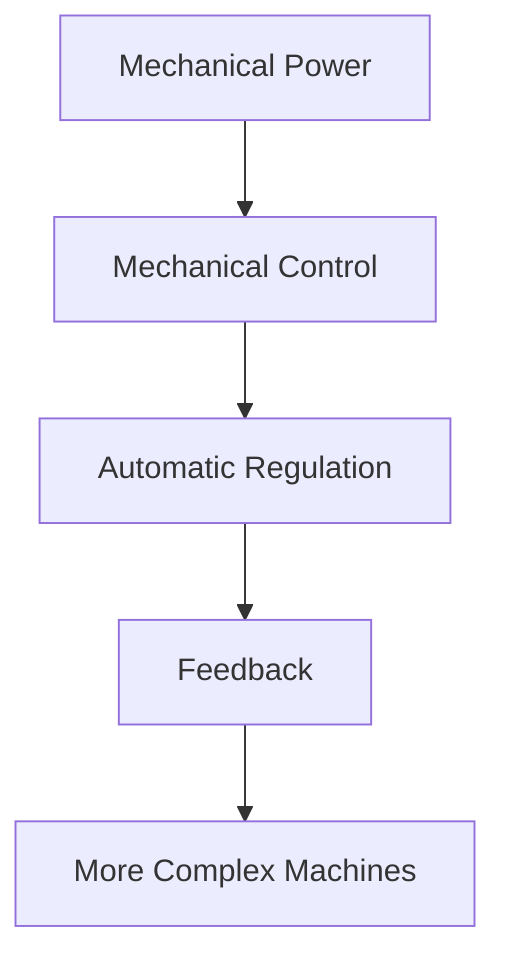

This period established a working pattern that would repeat at every later stage of this history: **a new class of machine appears → it becomes too complex for a human to control directly → an automatic regulation mechanism is invented to control it.**

---

## 7. The Second Industrial Revolution — Electrification

The Second Industrial Revolution (roughly the 1870s onward) replaced steam and line-shaft power with **electricity** — and this changed control forever.

- **Electric motors** could be placed exactly where power was needed, instead of everything being driven from one central steam engine via belts and shafts.
- **Electrified factories** enabled machines to be positioned by process logic, not by proximity to a power source.
- **Assembly-line production** became possible at real scale.
- Electrical signals — unlike mechanical linkages — could travel instantly over wires, over distance, and could be *switched*.

This is the point where **control starts to become electrical rather than purely mechanical** — switches, relays, and motors enter the factory.

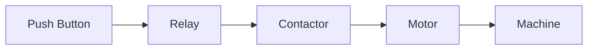

---

## 8. Relay Logic — The Predecessor of the PLC

As electrification matured, engineers built **control logic out of electromechanical relays** — a relay is simply a switch that is opened or closed by an electromagnet, allowing one circuit to control another.

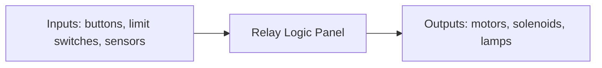

A simple motor-start sequence, wired entirely in relays:

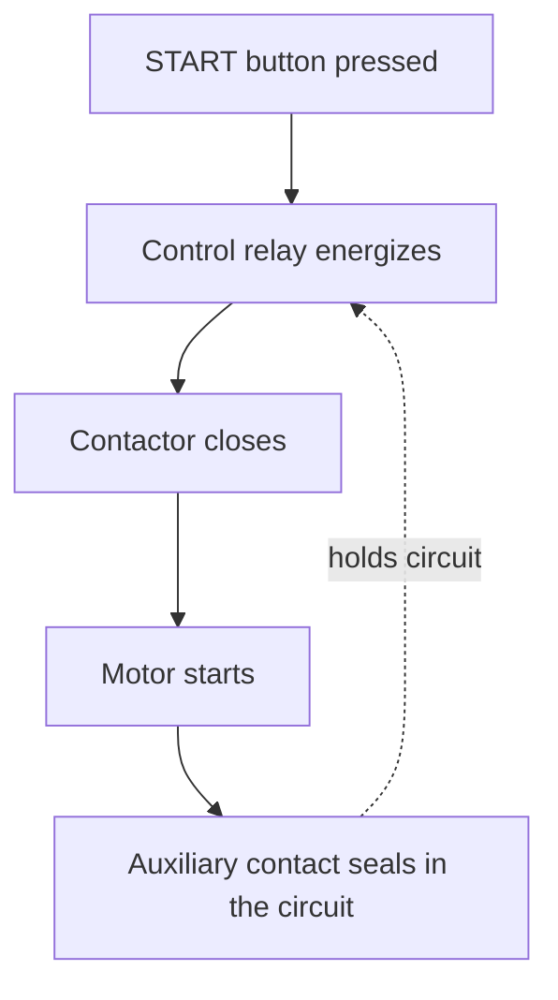

Relay logic worked — and versions of it are still found in simple machines today — but as processes grew more complex, the problem became structural, not electrical:

> As machines became more complex, relay panels grew enormous, were difficult to modify, expensive to maintain, and hard to troubleshoot. Every logic change meant physically rewiring the panel.

This single, painful limitation is the direct reason the PLC was invented (Section 12).

---

## 9. Ford and Mass Production

Henry Ford's moving assembly line, operational at the Highland Park plant from October 1913, is one of history's clearest demonstrations of why *control* — not just power — became essential to industry.


*The Ford Highland Park moving assembly line, 1913. (Source: [Wikimedia Commons](https://commons.wikimedia.org/wiki/File:Ford_assembly_line_-_1913.jpg), public domain)*

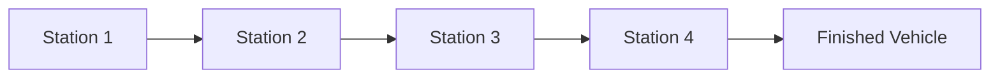

Mass production demanded:

- **Repeatability** — every unit built identically.
- **Standardized operations** — each station performing exactly one task, every time.
- **Synchronization** — stations had to work at matched speed, or the whole line would jam or starve.

Synchronizing dozens of stations by hand does not scale. This need for coordinated, repeatable, synchronized control is what later made relay panels, and then PLCs, indispensable on the factory floor.

---

## 10. Feedback Control Becomes a Science

By the early-to-mid 20th century, feedback stopped being a collection of clever mechanical tricks (governors, floats, regulators) and became a formal engineering discipline: **control theory**.

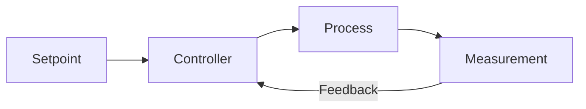

The vocabulary introduced here is used throughout the rest of this repository:

| Term | Meaning |
|---|---|
| **Setpoint** | The desired value (e.g., target temperature) |
| **Process variable** | The actual measured value |
| **Error** | Setpoint − Process variable |
| **Controller** | The element that calculates a correction from the error |
| **Actuator** | The element that physically applies the correction |
| **Feedback** | The measured signal returned to the controller |

When the setpoint changes, a well-tuned control loop drives the process variable back toward it, correcting itself continuously rather than waiting for a person to notice a deviation. This is the theoretical foundation for every PID loop discussed later in this repository.

---

## 11. Electronics and Computing Enter Automation

Control technology made another leap as **electronics** replaced purely electromechanical devices:

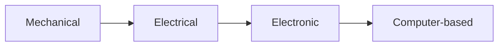

Key enabling technologies:

- **Vacuum tubes** — the first electronic amplifying/switching devices, bulky and fragile.
- **Transistors** — introduced in 1947, solid-state, reliable, and small; the technological foundation of modern electronic control.
- **Digital electronics** — logic built from transistor switches instead of mechanical relay contacts.
- **Early computers, memory, and digital logic** — enabling calculation-based rather than purely wired control.

An early landmark: a computer was used to directly control an industrial process at the Texaco refinery in Port Arthur, Texas, in 1959 — one of the first times a general-purpose computer, rather than dedicated analog or relay hardware, supervised a live industrial process.

This section stays intentionally high-level — the deep electronics content belongs in later chapters of this repository.

---

## 12. 1968–1970 — The Birth of the PLC

This is one of the defining milestones in industrial automation history.

**Before the PLC:**


**After the PLC:**


The story, in sequence:

1. In 1968, **General Motors' Hydra-Matic division** issued a request for an electronic replacement for hard-wired relay control systems, based on a white paper by engineer Edward R. Clark.
2. **Bedford Associates**, a Massachusetts engineering firm led by **Dick Morley**, won the proposal.
3. The result was the **Modicon 084** — its name simply came from being Bedford Associates' 84th project. "Modicon" stood for **Mo**dular **Di**gital **Con**troller.
4. A working prototype existed by March 1968; a commercial unit was delivered to GM around 1969–1970.
5. The 084 was programmed using **Ladder Logic** — a language deliberately designed to *look like* the relay ladder diagrams that electricians already knew how to read, easing adoption on the factory floor.
6. Dick Morley is widely regarded as the **father of the PLC**.


The Modicon 084 sold modestly at first. Its 1973 successor, the **Modicon 184**, became the commercial breakthrough that truly displaced relay panels across industry.

---

## 13. The Third Industrial Revolution — Computerized Automation

The arrival of microprocessors, PLCs, CNC machines, and electronic instrumentation is generally recognized as the **Third Industrial Revolution** — automation built on electronics and computing rather than purely electromechanical hardware.

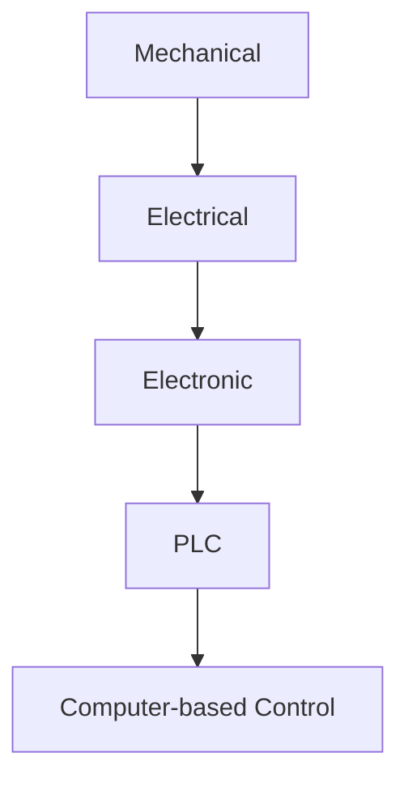

This is the era where the *logic* of a machine became something you could **change by editing a program**, instead of something you had to **change by rewiring hardware**.

---

## 14. 1975 — The Birth of the DCS

The PLC excelled at discrete, sequential machine control (start/stop, step sequences, interlocks). But large continuous processes — refineries, chemical plants, power generation — needed something architecturally different: control distributed across many process areas, with a unified operator view.

In 1975, **Honeywell introduced the TDC 2000**, widely credited as the first commercial **Distributed Control System (DCS)**. **Yokogawa's early CENTUM system** appeared around the same period. Rather than one central controller (or one giant relay cabinet) running everything, a DCS distributes many controllers across the plant, each handling a portion of the process, all tied together through a shared communication and operator-display system.

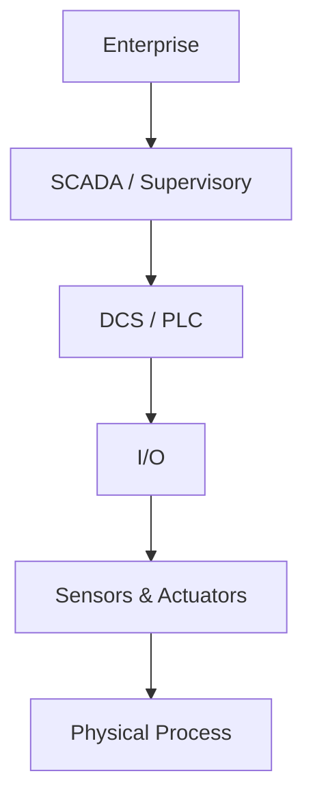

PLC and DCS solved different problems and grew up largely in parallel: PLCs dominated discrete manufacturing (automotive, packaging, machining); DCS dominated continuous process industries (oil & gas, chemicals, power). Modern systems increasingly blur this line, but understanding *why* each was invented explains a great deal about plant architecture today.

---

## 15. 1980s–1990s — Industrial Networking

As plants filled with multiple PLCs and DCS nodes, a new problem appeared: these "islands of automation" needed to talk to each other and to a human operator.

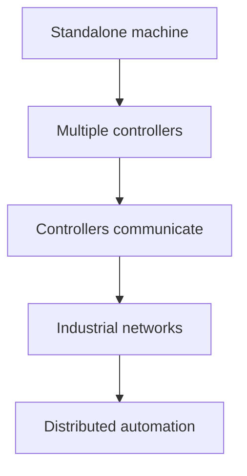

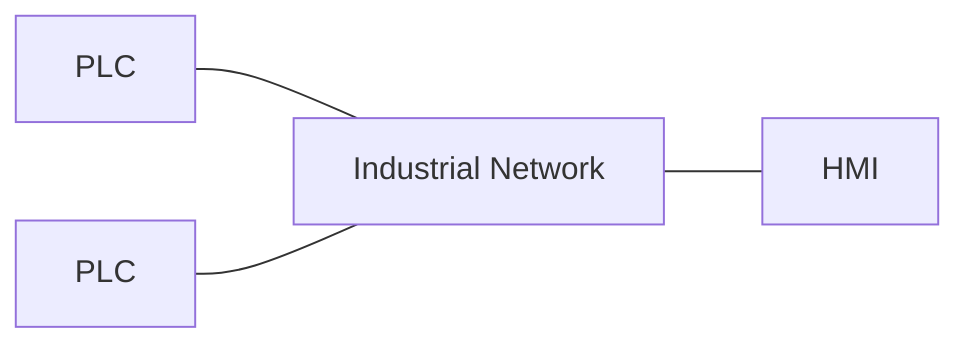

This era produced:

- **Fieldbus technologies** — digital, multi-drop communication replacing costly point-to-point wiring between every sensor/actuator and its controller.
- **Diagnostics over the network** — a device could now report its own health, not just its raw signal.
- **HMI/SCADA systems** — giving operators a unified visual window into many distributed controllers at once.

The core driver was economic and practical: point-to-point wiring for every I/O point does not scale once a plant has thousands of signals.

---

## 16. 2000s — Ethernet and Connected Automation

Standard **Ethernet** and **TCP/IP**, already dominant in office computing, moved onto the factory floor — ruggedized and adapted for real-time determinism, but fundamentally the same networking technology used everywhere else.

```mermaid
flowchart TB
    SN2[Sensor] --> IOm[I/O]
    IOm --> PLC4[PLC]
    PLC4 --> IE[Industrial Ethernet]
    IE --> HS[HMI / SCADA]
    HS --> HTX[Historian]
    HTX --> MES[MES]
    MES --> ERP[ERP]
```

Protocols such as **EtherNet/IP**, **PROFINET**, and **Modbus TCP** let controllers, drives, and I/O share a common physical network instead of dozens of proprietary fieldbuses — this is the foundation for the modern layered industrial architecture (field level → control level → supervisory level → enterprise level) used throughout this repository's later communication chapters.

---

## 17. Industry 4.0

The term **Industry 4.0** emerged around 2011, describing a shift from automation that simply *executes* to automation that *senses, connects, analyzes, and decides*.

```mermaid
flowchart LR
    Auto[Automation] --> Conn[Connectivity] --> Data[Data] --> Ana[Analytics] --> Intel[Intelligence]
```

```mermaid
flowchart TB
    Sen[Sensors produce data] --> Net2[Network]
    Net2 --> EC[Edge / Cloud]
    EC --> AnB[Analytics]
    AnB --> Dec[Decision]
```

Core ideas:

- **Cyber-physical systems** — physical machines tightly coupled with their digital models.
- **IIoT (Industrial Internet of Things)** — sensors and devices connected far beyond the traditional control network.
- **Edge and cloud computing** — processing data close to the source (edge) or centrally at scale (cloud).
- **Big data and machine learning** — using historical and real-time data to predict, optimize, and eventually assist or automate decisions.

---

## 18. Today — Connected, Intelligent Automation

```mermaid
flowchart TB
    H2[Human] --> M3[Mechanization]
    M3 --> AutoReg[Automatic Regulation]
    AutoReg --> ElecC[Electrical Control]
    ElecC --> RelL[Relay Logic]
    RelL --> PLC5[PLC]
    PLC5 --> SD[SCADA / DCS]
    SD --> IN2[Industrial Networks]
    IN2 --> IIoT[IIoT]
    IIoT --> Edge[Edge Computing]
    Edge --> AIA[AI-assisted Automation]
```

Every layer in this diagram is still in active use somewhere in industry today. Relay logic still exists in simple machines. PLCs still run most discrete manufacturing. DCS still runs most continuous process plants. And all of it is increasingly wrapped in IIoT connectivity, edge analytics, and AI-assisted decision support — layered on top of, not replacing, the control fundamentals established over the last 250 years.

---

## 19. The Master Evolution Diagram

```mermaid
flowchart TB
    A2[Human Control]
    A2 --> B2[Mechanization]
    B2 --> C2[Mechanical Feedback]
    C2 --> D2[Electrical Control]
    D2 --> E2[Relay Logic]
    E2 --> F2[Programmable Logic]
    F2 --> G2[PLC]
    G2 --> H2b[SCADA / DCS]
    H2b --> I2[Industrial Networking]
    I2 --> J2[IIoT]
    J2 --> K2[Connected / Intelligent Automation]
```

Read top to bottom, this single diagram is the entire history of this document compressed into eleven steps — every stage exists because the stage above it hit a limit that could not be solved by simply adding more of the same technology.

---

## 20. What Actually Changed at Every Stage?

The most important question in this chapter is not "what was invented?" but **"what problem did it solve, and what changed as a result?"**

| Era | What Changed | Main Technology | Human Role |
|---|---|---|---|
| Manual | — | Human operation | High |
| Mechanization | Human physical effort reduced | Steam / water-powered machines | High |
| Feedback | Machine began regulating itself | Watt's governor | Medium |
| Electrification | Control became easier to distribute; production sped up | Motors, relays, contactors | Medium |
| Relay Logic | Complex sequences automated, but hard to change | Electromechanical relays | Lower |
| Programmable Control | Logic became changeable without rewiring | PLC (Modicon 084/184) | Lower |
| Distributed Control | Large continuous processes controlled at scale | DCS (Honeywell TDC 2000) | Supervisory |
| Networked | Machines began communicating with each other | Fieldbus, industrial networks | Supervisory |
| Digital | Plant-wide data became visible and historized | SCADA / MES / Historians | Data-driven |
| Connected | Machines connected beyond the plant floor | Industrial Ethernet, IIoT | Data-driven |
| Intelligent | Data began supporting advanced, predictive decisions | Edge / Cloud / AI analytics | Supervisory + strategic |

---

## 21. The First-Principles Mental Model

Every major evolution in the history of industrial automation was an attempt to improve one or more of the following:

```
Human effort → Repeatability → Speed → Precision → Safety → Flexibility → Information → Connectivity → Intelligence
```

That progression is the single idea worth carrying forward into every later chapter of this repository: automation is not a list of inventions — it is a continuous, 250-year effort to remove a specific limitation, one stage at a time.

> **Important distinction to carry forward:** don't treat "Industry 1.0 → 2.0 → 3.0 → 4.0" as if those four labels *are* the entire history. They're a useful coarse framework, but automation also evolved through feedback control, instrumentation, electronics, PLCs, DCS, networking, and SCADA — technologies that developed across overlapping periods, not in a single straight line.

---

## 22. References

- ISA (International Society of Automation) — timeline of automation milestones and Industrial Revolution framework.
- Schneider Electric — official history of the Modicon PLC and Dick Morley.
- Computer History Museum, *The Storage Engine* — punched cards and the Jacquard loom.
- *Programmable Logic Controller*, Wikipedia — Modicon 084 origin and GM Hydra-Matic request for proposals.
- *Centrifugal Governor*, Wikipedia — James Watt's 1788 governor.
- AutomationDirect Library — "History of the PLC."
- Wikimedia Commons — public-domain and Creative-Commons-licensed historical photographs (credited individually above each image).

---

## Suggested Repository Structure for This Chapter

```
02-where-did-industrial-automation-begin-history/
│
├── 02-where-did-industrial-automation-begin-history.md   ← this file
│
├── images/
│   ├── watt-governor.jpg
│   ├── jacquard-loom.jpg
│   ├── ford-assembly-line.jpg
│   ├── relay-panel.jpg
│   └── automation-evolution.svg
│
└── animations/
    ├── watt-governor.html          (interactive feedback-loop animation)
    ├── relay-to-plc.html           (relay panel → PLC transition)
    ├── plc-evolution.html          (084 → 184 → modern PLC)
    └── automation-timeline.html    (full timeline build-out)
```

**Notes for building this out on GitHub:**
- All the flowcharts above are written in **Mermaid**, which GitHub renders natively inside `.md` files — no image export needed for these.
- For the historical photographs, either keep them as hot-linked Wikimedia URLs (as done above, with credit lines) or download the originals into `/images` and switch the links to relative paths — useful if you want the repository to work fully offline.
- Reserve `.html` files in `/animations` for the genuinely interactive pieces (the Watt governor loop, the relay-to-PLC morph, the full timeline build) and publish them via **GitHub Pages** so DeepURForge becomes an interactive learning site, not just a folder of Markdown.
- Keep a source/reference line under every image and diagram, exactly as done throughout this file — it is what will make the repository read as a credible research project rather than a notes dump.
